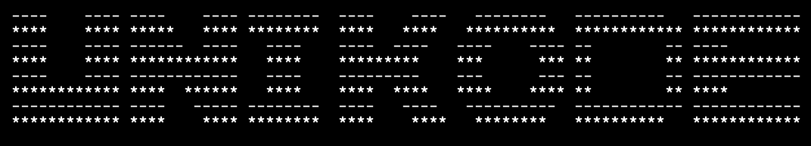
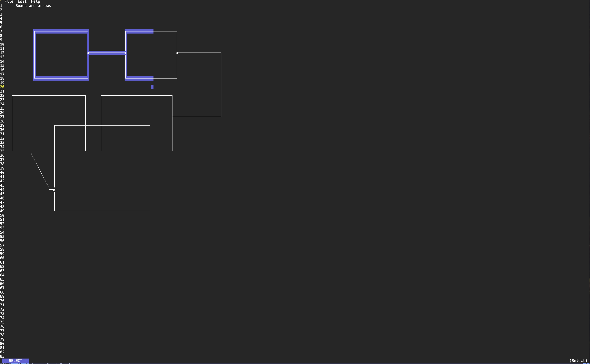

# Unikode

[](LICENSE-MIT)

<p align="center">
  
</p>

## Background

Unikode is a fork of the excellent [askii](https://github.com/nytopop/askii) project by [nytopop](https://github.com/nytopop). While it maintains the core spirit of the original tool, it focuses on enhanced Unicode support, refined selection/move mechanics, and improved terminal interaction.

## Screenshot
<p align="center">
  
</p>

## Features

- **Intuitive TUI:** A responsive terminal interface built with Cursive.
- **Diagram Tools:** Support for boxes, arrows, lines, and text.
- **Smart Selection:** Easily select, move, and erase sections of your diagram.
- **Lazy Scrolling:** The canvas intelligently adjusts to your content, ensuring a clean editing experience.
- **Vi-style Navigation:** Efficient cursor movement (`h`, `j`, `k`, `l`).
- **Clipboard Integration:** Easily copy and paste diagrams to and from your system clipboard.

## Installation

### Prerequisites

Unikode requires the Rust toolchain. If you don't have it, you can install it via [rustup.rs](https://rustup.rs/).

On Linux, you may need X11 development libraries for clipboard support:

```bash
# Arch Linux
sudo pacman -S libxcb

# Debian/Ubuntu
sudo apt install libxcb1-dev libxcb-render0-dev libxcb-shape0-dev libxcb-xfixes0-dev libxau-dev libxdmcp-dev
```

### Build from Source

```bash
git clone https://github.com/stevenp2/unikode.git
cd unikode
cargo install --path .
```

## Usage

Start Unikode by running the binary:

```bash
unikode [filename.txt]
```

### Modes and Tools

Unikode uses a modal editing system. Press the corresponding key to activate a tool.

- **Normal Mode:** The default mode for navigation.
- **Select Mode (`s`):** Click and drag with the left mouse button to define a selection area.
  - **Move (`m`):** While an area is selected, press `m` to enter Move mode. You can move the selection using navigation keys (`h`,`j`,`k`,`l`) or by dragging with the mouse.
    - Press `Enter` to place the characters and restart selection at the new position.
    - Press `Esc` to place the characters and return to Normal mode.
  - **Erase (`e`):** Press `e` to delete all characters within the selection.
- **Box Tool (`b`):** Click and drag to draw a box. The tool automatically handles line joins and corners.
- **Line Tool (`L`):** Click and drag to draw lines.
  - **Cycle Path Mode (`p` or `r`):** Press `p` (globally) or `r` (while drawing) to switch between **Snap90** (right angles) and **Routed** (shortest path) line drawing.
- **Arrow Tool (`a`):** Similar to the Line tool, but adds an arrowhead at the destination.
- **Text Tool (`t`):** Click anywhere to place a text cursor and start typing. Press `Esc` to commit the text and return to Normal mode.

### Navigation (Normal & Select Mode)

- `h`, `j`, `k`, `l`: Move the cursor Left, Down, Up, and Right.
- `0`: Move the cursor to the absolute beginning of the line.
- `^`: Move to the first non-whitespace character on the line.
- `$`: Move to the last non-whitespace character on the line.
- **Numeric Prefixes:** You can prefix movement keys with numbers (e.g., `10j` moves down 10 lines).

### Global Commands

- `u`: Undo the last action.
- `Ctrl + r`: Redo the last undone action.
- `w`: Save the current file.
- `S`: Save As (prompt for a new filename).
- `T`: Trim Margins (removes empty outer space and resets cursor to `0,0`).
- `q`: Quit the application.
- `?`: Show the help overlay.

## License

This project is licensed under the MIT License - see the [LICENSE-MIT](LICENSE-MIT) file for details.
